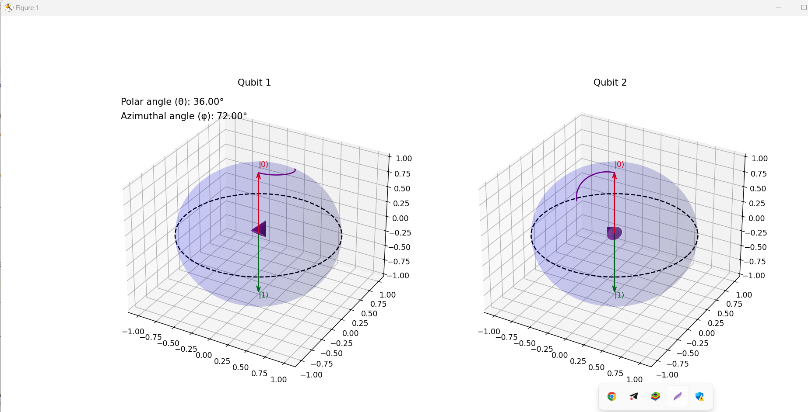

# Quantum Computing Visualization: Bloch Sphere and Entanglement

## Overview
This repository contains Python code to visualize the states of qubits using the Bloch sphere representation and demonstrates quantum entanglement between qubits. The animations help in understanding the dynamics of qubit states, superposition, and entanglement.

## Bloch Sphere

The Bloch sphere is a geometrical representation of the pure state space of a two-level quantum mechanical system (qubit). It provides an intuitive way of visualizing the state of a qubit.

### Mathematical Representation

A qubit state can be represented as:
\[ |\psi\rangle = \alpha|0\rangle + \beta|1\rangle \]
where \( \alpha \) and \( \beta \) are complex numbers satisfying:
\[ |\alpha|^2 + |\beta|^2 = 1 \]

On the Bloch sphere, the qubit state is represented as a point on the surface of a unit sphere:
\[ |\psi\rangle = \cos\left(\frac{\theta}{2}\right)|0\rangle + e^{i\phi}\sin\left(\frac{\theta}{2}\right)|1\rangle \]

Here, \( \theta \) and \( \phi \) are spherical coordinates:
- \( \theta \) (polar angle) ranges from 0 to \( \pi \)
- \( \phi \) (azimuthal angle) ranges from 0 to \( 2\pi \)

### Visualization

The Bloch sphere allows us to visualize:
- **Superposition**: Any state can be represented as a vector on the sphere.
- **Phase**: The relative phase between \( |0\rangle \) and \( |1\rangle \) can be visualized by the rotation around the z-axis.
- **Operations**: Quantum gates can be visualized as rotations of the state vector on the sphere.

## Quantum Entanglement

Quantum entanglement is a physical phenomenon where pairs or groups of qubits are generated, interact, or share spatial proximity in ways such that the quantum state of each qubit cannot be described independently of the state of the others.

### Entanglement and the Bloch Sphere

Entanglement involves multiple qubits. In the case of two qubits, their combined state can be represented as:
\[ |\psi\rangle_{AB} = \alpha|00\rangle + \beta|01\rangle + \gamma|10\rangle + \delta|11\rangle \]

For maximally entangled states, like the Bell states:
\[ |\Phi^+\rangle = \frac{1}{\sqrt{2}}(|00\rangle + |11\rangle) \]
\[ |\Psi^+\rangle = \frac{1}{\sqrt{2}}(|01\rangle + |10\rangle) \]

Each qubit's state is correlated with the state of the other qubit.

## Repository Content

- **Initial State of Qubits**: Visualization of the initial states of two qubits.
- **Applying Hadamard Gate**: Animation showing the transition of a qubit to a superposition state using the Hadamard gate.
- **Entanglement**: Animation demonstrating entanglement between two qubits using the controlled NOT (CNOT) gate.
- **Bloch Sphere Representation**: Combined animation showing the Bloch sphere representation and the entangled states of two qubits.

## Usage

### Prerequisites

- Python 3.x
- Matplotlib
- NumPy

### Running the Code

1. Clone the repository:
    ```bash
    git clone https://github.com/yourusername/quantum-entanglement-visualization.git
    cd quantum-entanglement-visualization
    ```

2. Install the required packages:
    ```bash
    pip install matplotlib numpy
    ```

3. Run the visualization script:
    ```bash
    python visualize_entanglement.py
    ```

## Example Output



## License

This project is licensed under the MIT License - see the [LICENSE](LICENSE) file for details.

## Acknowledgments

- Quantum Computing concepts based on materials from [Qiskit](https://qiskit.org/) and other educational resources.
- Visualization inspired by various quantum computing visual tools and examples.

